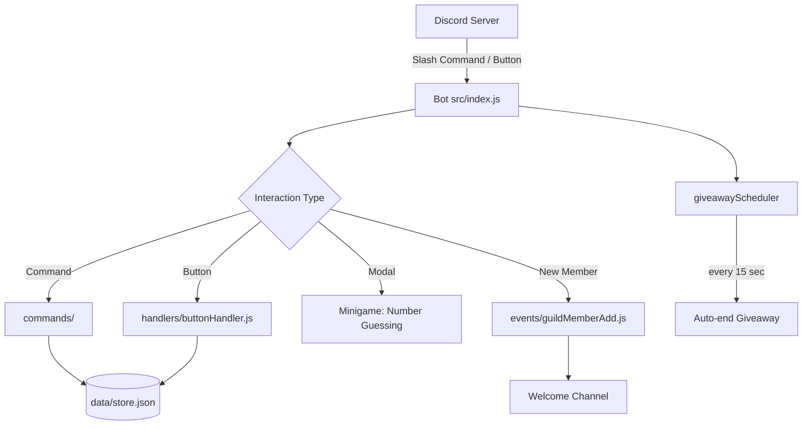

# Discord Community Bot

A modular Discord bot for community servers with **welcome messages**, a **ticket system**, **giveaways**, **polls**, and **minigames**.

Built with **Node.js** and [discord.js v14](https://discord.js.org/), using **slash commands** and **buttons** for interaction.

---

## Table of Contents

- [Features](#features)
- [How the Bot Works](#how-the-bot-works)
- [Project Structure](#project-structure)
- [Requirements](#requirements)
- [Installation & Setup](#installation--setup)
- [Setting Up the Discord Bot](#setting-up-the-discord-bot)
- [Configuration (.env)](#configuration-env)
- [Slash Commands](#slash-commands)
- [Modules in Detail](#modules-in-detail)
- [Uploading to GitHub](#uploading-to-github)
- [Keeping the Bot Online](#keeping-the-bot-online)
- [Troubleshooting](#troubleshooting)
- [License](#license)

---

## Features

| Module | Description |
|--------|-------------|
| 👋 **Welcome** | Automatically greets new members with an embed |
| 🎫 **Tickets** | Support tickets via button — private channel per user |
| 🎁 **Giveaways** | Timed raffles with an entry button |
| 📊 **Polls** | Voting with up to 5 options and live results |
| 🎮 **Minigames** | Rock/Paper/Scissors, Tic-Tac-Toe, number guessing, trivia |

---

## How the Bot Works



**Overview:**

1. **`src/index.js`** starts the bot and automatically loads all commands and events from the folders.
2. **`src/deploy-commands.js`** registers slash commands with Discord (run once before the first start).
3. **`src/events/interactionCreate.js`** routes slash commands, button clicks, and modals to the correct handlers.
4. **`src/database.js`** stores giveaways, polls, tickets, and participants in `data/store.json`.
5. **`src/utils/giveawayScheduler.js`** checks every 15 seconds whether a giveaway has expired and automatically picks winners.

---

## Project Structure

```
discord-community-bot/
├── src/
│   ├── index.js              # Bot entry point
│   ├── deploy-commands.js    # Register slash commands with Discord
│   ├── config.js             # Loads settings from .env
│   ├── database.js           # JSON storage (giveaways, polls, tickets)
│   ├── commands/
│   │   ├── general/help.js
│   │   ├── ticket/ticket.js
│   │   ├── giveaway/giveaway.js
│   │   ├── umfrage/umfrage.js
│   │   └── minigame/minigame.js
│   ├── events/
│   │   ├── ready.js
│   │   ├── guildMemberAdd.js # Welcome
│   │   └── interactionCreate.js
│   ├── handlers/
│   │   └── buttonHandler.js  # Ticket, giveaway, poll, minigame buttons
│   └── utils/
│       ├── giveaways.js
│       ├── giveawayScheduler.js
│       ├── tickets.js
│       ├── minigames.js
│       └── constants.js
├── data/
│   └── store.json            # Created automatically (do not commit!)
├── .env.example              # Template for your configuration
├── package.json
└── README.md
```

---

## Requirements

- [Node.js](https://nodejs.org/) **18 or higher**
- A Discord account
- A [Discord Application / Bot](https://discord.com/developers/applications)

---

## Installation & Setup

```bash
# Clone the repository (after uploading to GitHub)
git clone https://github.com/YOUR-USERNAME/discord-community-bot.git
cd discord-community-bot

# Install dependencies
npm install

# Create configuration file
copy .env.example .env   # Windows
# cp .env.example .env   # Linux / macOS

# Edit .env and add your token + IDs (see below)

# Register slash commands with Discord
npm run deploy

# Start the bot
npm start
```

**Development with auto-reload:**

```bash
npm run dev
```

---

## Setting Up the Discord Bot

### 1. Create an Application

1. Open the [Discord Developer Portal](https://discord.com/developers/applications)
2. **New Application** → choose a name
3. Go to **Bot** → **Add Bot**
4. Copy the token → add it to `.env` as `DISCORD_TOKEN`

### 2. Enable Intents

Under **Bot** → **Privileged Gateway Intents**:

| Intent | Why |
|--------|-----|
| ✅ **Server Members Intent** | Required for welcome messages when new members join |

### 3. Invite the Bot to Your Server

Under **OAuth2 → URL Generator**:

- **Scopes:** `bot`, `applications.commands`
- **Bot Permissions:**
  - View Channels
  - Send Messages
  - Embed Links
  - Read Message History
  - Manage Channels *(for tickets)*
  - Use External Emojis

Open the generated URL and invite the bot to your server.

### 4. Finding IDs

In Discord: enable **Settings → Advanced → Developer Mode**, then right-click a channel/role/server → **Copy ID**.

| ID | Where to put it |
|----|-----------------|
| Application ID | `.env` → `CLIENT_ID` |
| Server ID | `.env` → `GUILD_ID` |
| Welcome channel | `.env` → `WELCOME_CHANNEL_ID` |
| Ticket category | `.env` → `TICKET_CATEGORY_ID` |
| Support role | `.env` → `SUPPORT_ROLE_ID` |

---

## Configuration (.env)

Copy `.env.example` to `.env` and fill in your values:

```env
# Required
DISCORD_TOKEN=your_bot_token
CLIENT_ID=your_application_id
GUILD_ID=your_server_id

# Welcome (optional)
WELCOME_CHANNEL_ID=123456789012345678
WELCOME_MESSAGE=Welcome {user} to **{server}**! You are member #{memberCount}.

# Tickets (optional, but recommended)
TICKET_CATEGORY_ID=123456789012345678
SUPPORT_ROLE_ID=123456789012345678
TICKET_LOG_CHANNEL_ID=123456789012345678

# Giveaways (optional – default channel)
GIVEAWAY_CHANNEL_ID=123456789012345678
```

**Placeholders in `WELCOME_MESSAGE`:**

| Placeholder | Replaced with |
|-------------|---------------|
| `{user}` | User mention (`@Name`) |
| `{username}` | Discord username |
| `{server}` | Server name |
| `{memberCount}` | Current member count |

> ⚠️ **Important:** The `.env` file contains your bot token. It must **never** be uploaded to GitHub (already listed in `.gitignore`).

---

## Slash Commands

| Command | Permission | Description |
|---------|------------|-------------|
| `/help` | Everyone | Shows all commands |
| `/ticket panel` | Manage Channels | Posts the ticket panel with a button |
| `/giveaway start` | Manage Server | Starts a giveaway |
| `/giveaway end` | Manage Server | Ends a giveaway early |
| `/giveaway reroll` | Manage Server | Picks new winners |
| `/umfrage erstellen` | Manage Messages | Creates a poll (2–5 options) |
| `/umfrage beenden` | Manage Messages | Closes a poll |
| `/minigame rps` | Everyone | Rock, Paper, Scissors |
| `/minigame tictactoe` | Everyone | Tic-Tac-Toe vs bot |
| `/minigame zahlen` | Everyone | Guess a number between 1–100 |
| `/minigame trivia` | Everyone | Start a quiz question |
| `/minigame antworten` | Everyone | Submit a trivia answer |

> **Note:** Poll and minigame subcommands use German names (`erstellen`, `beenden`, `zahlen`, `antworten`) in the code. You can rename them in `src/commands/` if you prefer English command names.

**Giveaway duration format:** `30s`, `15m`, `2h`, `1d` (minimum: 10 seconds)

**Example:**

```
/giveaway start preis:Nitro dauer:1d gewinner:2
```

---

## Modules in Detail

### 👋 Welcome

- **Event:** `guildMemberAdd`
- **File:** `src/events/guildMemberAdd.js`
- When a new member joins and `WELCOME_CHANNEL_ID` is set, the bot sends an embed with their avatar, a welcome message, and the member count.

### 🎫 Tickets

1. Admin runs `/ticket panel` → message with a **"Create Ticket"** button
2. User clicks the button → bot creates a private text channel in the ticket category
3. Only the user and the support role can see the channel
4. **"Close Ticket"** button → channel is deleted after 5 seconds, optional log entry

**Setup:**

1. Create a "Tickets" category on your server
2. Create a support role (optional)
3. Add the IDs to `.env`
4. Run `/ticket panel` in your support channel

### 🎁 Giveaways

1. `/giveaway start` with prize and duration
2. Bot posts an embed with an **"Enter"** button
3. Users click to join (once per person)
4. After the timer expires, the scheduler automatically picks winners
5. `/giveaway end` ends early, `/giveaway reroll` picks new winners

Winners are chosen randomly from all participants.

### 📊 Polls

1. `/umfrage erstellen` with a question and 2–5 options
2. Bot posts a button for each option
3. Users vote — results update live with a bar chart
4. Each user can change their vote (last vote counts)
5. `/umfrage beenden` with the message ID closes the poll

### 🎮 Minigames

| Game | How it works |
|------|--------------|
| **RPS** | Buttons for rock/paper/scissors, bot picks randomly |
| **Tic-Tac-Toe** | 3×3 button grid, user = X, bot = O (simple AI) |
| **Number Guessing** | Modal input, 7 attempts, higher/lower hints |
| **Trivia** | Random question, answer with `/minigame antworten text:...` |

---

## Uploading to GitHub

### Step 1: Create a GitHub Repository

1. Log in at [github.com](https://github.com)
2. **New repository** → name it e.g. `discord-community-bot`
3. Choose **Public** or **Private**
4. Create it **without** README, .gitignore, or license (we already have those locally)

### Step 2: Upload the Project

In your project folder (PowerShell / Terminal):

```bash
cd discord-community-bot

git init
git add .
git commit -m "Initial commit: Discord Community Bot"
git branch -M main
git remote add origin https://github.com/YOUR-USERNAME/discord-community-bot.git
git push -u origin main
```

Replace `YOUR-USERNAME` with your GitHub username.

### What to Upload — and What Not to

| File/Folder | GitHub |
|-------------|--------|
| `src/`, `package.json`, `README.md`, `.env.example` | ✅ Yes |
| `.env` (bot token!) | ❌ No — in `.gitignore` |
| `node_modules/` | ❌ No — in `.gitignore` |
| `data/store.json` | ❌ No — local bot data |

> After cloning on a new machine: `npm install`, create `.env`, `npm run deploy`, `npm start`.

---

## Keeping the Bot Online

The bot only runs while `node src/index.js` is active. Options:

| Method | Best for |
|--------|----------|
| **Your own PC** | Testing, small servers |
| **VPS** (Hetzner, Contabo, etc.) | 24/7 uptime, affordable |
| **Railway / Render** | Easy hosting without server setup |
| **PM2** on Linux VPS | Auto-restart on crash |

**PM2 example (Linux VPS):**

```bash
npm install -g pm2
pm2 start src/index.js --name discord-bot
pm2 save
pm2 startup
```

---

## Troubleshooting

| Problem | Solution |
|---------|----------|
| Slash commands don't appear | Run `npm run deploy`, check `GUILD_ID`, wait 1–2 minutes |
| Welcome doesn't work | Enable **Server Members Intent**, check `WELCOME_CHANNEL_ID` |
| Bot won't start | Is `.env` present? Are `DISCORD_TOKEN` and `CLIENT_ID` set? |
| Tickets aren't created | Bot needs **Manage Channels**, check `TICKET_CATEGORY_ID` |
| `Missing environment variable` | Fill in all required values in `.env` |
| Giveaway doesn't end | Bot must be running (scheduler checks every 15 seconds) |

**Logs:** Errors appear in the console where you run `npm start`.

---

## License

MIT — free to use, modify, and distribute.
